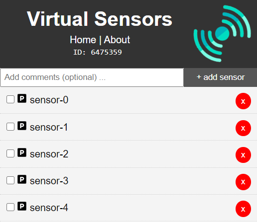

# mqtt-virtual-sensor
This is a simplified MQTT virtual sensor 
[](https://travis-ci.org/joemccann/dillinger)

you can also try the online version deployed at [heroku](https://virtual-sensor.herokuapp.com/) server.

# New Features!

  - First version.

# Installation
To install the virtual sensor
[Install NodeJs](https://nodejs.org/en/download/package-manager/)

Then clone this project into your server
```
$ git clone https://github.com/mohgeis/mqtt-virtual-sensor.git
```
finally install and run the virtual sensor
```
$ cd mqtt-virtual-sensor
$ npm install
$ npm start
```
Then open a page in the browser and navigate to localhost:5000/

you should see this page:
[]
